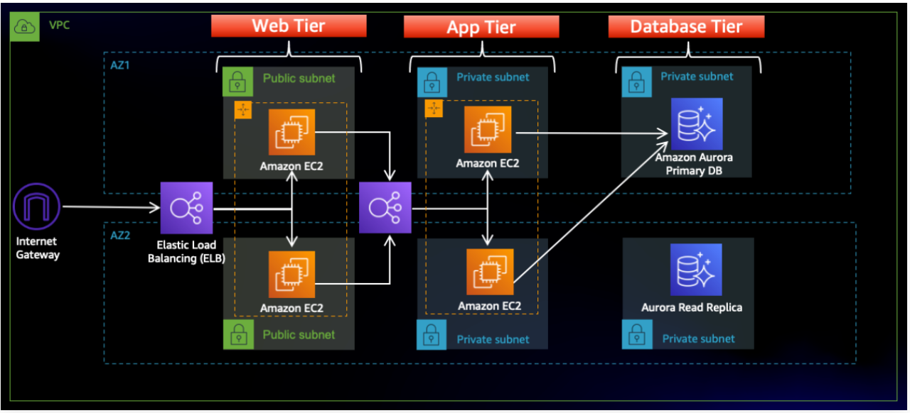

**Discover the power of 3-Tier Architecture!**  
A 3-Tier Architecture app separates the presentation, application, and database layers, enhancing scalability, manageability, and security. This project showcases a robust AWS implementation of the architecture.

---

## 🚀 **In this Project, I have used the following AWS services:**

- **VPC**  
- **S3**  
- **IAM**  
- **EC2**  
- **RDS**  
- **Route 53**

```
🚀 3 Tier-Architecture
``` 



